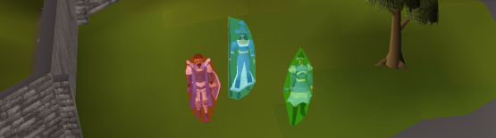

# Multicolor Highlights

Allows for highlighting of NPCs with different colors to easily distinguish between them.

Currently, this plugin is NOT meant as a replacement for runelite's npc indicators plugin, but as an addition.

## Features

- 5 customizable color groups
- toggleable hull outline and hull fill highlighting styles

## Todo

- more highlighting styles
- shift-right-click menu options to add npcs to groups
- minimap overlays

Submit an [issue](https://github.com/sgfost/multicolor-highlights/issues/new) or [pull request](https://github.com/sgfost/multicolor-highlights/pulls) with any feature requests or improvements.
